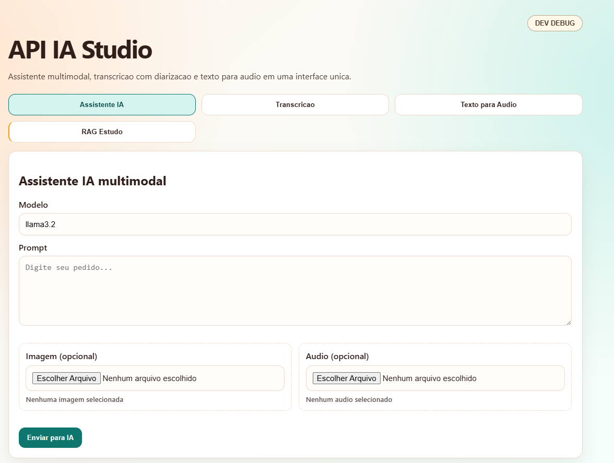

# API-IA - Aplicação Integrada de Inteligência Artificial

> Aplicação full-stack para estudo de IA local com Java, Spring Boot, Angular, Ollama, WhisperX e TTS.

## �️ Interface



## �📋 Sobre o Projeto

**API-IA** é uma aplicação educacional que integra três serviços de inteligência artificial em uma plataforma única:

- **🤖 IA Local (Ollama)**: Processamento de linguagem natural com modelos LLM executados localmente
- **🎙️ Transcrição (WhisperX)**: Transcrição de áudio com identificação automática de falantes
- **🔊 Síntese de Fala (TTS)**: Conversão de texto em áudio natural

Desenvolvida com **clean architecture**, **RFC 7807** para tratamento de erros, e padrões de resiliência.

---

## 🏗️ Arquitetura

### Stack Tecnológico

```
┌─────────────────────────────────────────────────┐
│           Frontend (Angular 19 + TS)             │
│  - Abas: Assistant, Transcrição, TTS            │
│  - Suporte multimodal (imagem + áudio + texto)  │
│  - Painel DEV DEBUG para erros                   │
│  - Porta: 4200                                  │
└────────────────┬────────────────────────────────┘
                 │ HTTP/REST + Interceptor
┌────────────────▼────────────────────────────────┐
│    Backend (Spring Boot 3.5 + Java 25)          │
│  - Clean Architecture (Hexagonal)               │
│  - RFC 7807 (Problem Details)                   │
│  - Resilience4j (Retry, Circuit-Breaker, etc)  │
│  - CORS configurado                             │
│  - Porta: 8080                                  │
└────────────────┬────────────────────────────────┘
                 │
     ┌───────────┼───────────┐
     │           │           │
┌────▼────┐ ┌────▼────┐ ┌───▼────┐
│ Ollama  │ │WhisperX │ │  (TTS) │
│ :11434  │ │ :9000   │ │ integ. │
└─────────┘ └─────────┘ └────────┘
```

### Arquitetura Hexagonal (Backend)

```
src/main/java/com/apiia/
├── adapters/           # Camada externa (Controllers, adaptadores)
│   ├── inbound/rest/   # REST Controllers
│   └── outbound/       # Integrações (Ollama, WhisperX)
├── application/        # Casos de uso (Clean Architecture)
│   ├── ports/          # Interfaces (contrattos)
│   └── usecases/       # Implementações de negócio
├── config/             # Configuração (Spring, CORS, Resilience)
├── common/             # Código compartilhado
│   ├── error/          # Tratamento de erros RFC 7807
│   └── correlation/    # Rastreamento de requisições
└── domain/             # Entidades de domínio
```

---

## 🛠️ Tecnologias

### Backend
| Tecnologia | Versão | Propósito |
|-----------|--------|----------|
| **Java** | 25 | Linguagem de programação |
| **Spring Boot** | 3.5.0 | Framework web |
| **Spring Web** | 6.2.7 | MVC e REST |
| **Tomcat** | 10.1.41 | Servlet container |
| **Maven** | 3.9.10 | Build e dependências |
| **Resilience4j** | Latest | Padrões de resiliência |
| **Jackson** | Latest | Serialização JSON |

### Frontend
| Tecnologia | Versão | Propósito |
|-----------|--------|----------|
| **Angular** | 19 | Framework web |
| **TypeScript** | 5.6+ | Linguagem compilada |
| **RxJS** | 7.8+ | Programação reativa |
| **npm** | 10+ | Package manager |

### Infraestrutura
| Serviço | Porta | Propósito |
|---------|-------|----------|
| **Docker Compose** | - | Orquestração |
| **Ollama** | 11434 | Servidor LLM local |
| **WhisperX** | 9000 | Transcrição de áudio |
| **Backend** | 8080 | API REST |
| **Frontend** | 4200 | Interface web |

---

## 📦 Pré-requisitos

### Windows
```bash
# Verificar instalações
java -version          # Java 25+
mvn --version         # Maven 3.9+
node --version        # Node.js 20+
npm --version         # npm 10+
docker --version      # Docker Desktop
```

**Download:**
- [Java 25 JDK](https://www.oracle.com/java/technologies/downloads/)
- [Maven](https://maven.apache.org/download.cgi)
- [Node.js](https://nodejs.org/)
- [Docker Desktop](https://www.docker.com/products/docker-desktop)

### Linux/macOS
```bash
# Ubuntu/Debian
sudo apt-get install openjdk-25-jdk maven nodejs npm docker.io docker-compose

# macOS (Homebrew)
brew install openjdk@25 maven node docker
```

---

## 🚀 Inicialização Rápida

### Windows
```bash
cd scripts
.\start.bat
```

### Linux/macOS
```bash
cd scripts
chmod +x start.sh
./start.sh
```

### Processo Automático
1. ✅ Docker Compose levanta Ollama e WhisperX
2. ✅ Aguarda disponibilidade dos serviços (health checks)
3. ✅ Backend Spring Boot inicia na porta 8080
4. ✅ Aguarda health check do backend
5. ✅ Frontend Angular inicia na porta 4200

### URLs de Acesso
- **Frontend**: http://localhost:4200
- **Backend API**: http://localhost:8080
- **Health Backend**: http://localhost:8080/actuator/health
- **Health WhisperX**: http://localhost:9000/health

---

## 🛑 Parar a Aplicação

### Windows
```bash
cd scripts
.\stop.bat
```

### Linux/macOS
```bash
cd scripts
./stop.sh
```

---

## 📂 Estrutura de Diretórios

```
API-IA/
│
├── src/                           # Código-fonte Java
│   ├── main/
│   │   ├── java/com/apiia/       # Classes Java
│   │   │   ├── adapters/inbound/rest/   # Controllers REST
│   │   │   │   ├── IaLocalController.java
│   │   │   │   ├── TranscriptionController.java
│   │   │   │   └── TtsController.java
│   │   │   ├── application/
│   │   │   │   ├── ports/         # Interfaces (Clean Arch)
│   │   │   │   └── usecases/      # Lógica de negócio
│   │   │   ├── config/            # Configurações Spring
│   │   │   ├── common/error/      # Tratamento de erros RFC 7807
│   │   │   └── domain/            # Entidades
│   │   └── resources/
│   │       ├── application.yml    # Configurações
│   │       └── logback-spring.xml # Logging
│   └── test/java/                 # Testes automatizados
│
├── frontend/                       # Código-fonte Angular
│   ├── src/
│   │   ├── app/
│   │   │   ├── core/
│   │   │   │   ├── api.service.ts         # Serviço HTTP
│   │   │   │   ├── api-error.model.ts     # Modelos de erro
│   │   │   │   └── correlation.interceptor.ts
│   │   │   ├── app.component.ts            # Componente raiz
│   │   │   ├── app.config.ts               # Configuração
│   │   │   ├── app.routes.ts               # Rotas
│   │   │   └── app.component.html/scss
│   │   ├── environments/
│   │   │   └── environment.ts              # Configurações de env
│   │   └── main.ts                         # Bootstrap
│   ├── angular.json
│   ├── tsconfig.json
│   └── package.json
│
├── scripts/                        # Automação
│   ├── start.bat / start.sh        # Inicializar aplicação
│   └── stop.bat / stop.sh          # Parar aplicação
│
├── docker-compose.yml              # Orquestração de serviços
├── pom.xml                         # Dependências Maven
├── README.md                       # Este arquivo
└── README_PT.md                    # Documentação detalhada (PT)

```

---

## 🖥️ Frontend (Angular)

### Funcionalidades
- **3 Abas Principais**:
  1. **Assistant**: Consulta IA local (texto ou multimodal)
  2. **Transcription**: Upload e transcrição de áudio
  3. **TTS**: Síntese de texto em fala

### Suporte Multimodal
- Entrada de **texto** (opcional)
- Upload de **imagem** (JPEG, PNG, WebP - até 10MB)
- Upload de **áudio** (MP3, WAV, M4A - até 200MB)

### Painel DEV DEBUG
- Disponível em modo desenvolvimento
- Exibe: Correlation ID, timestamps, erros técnicos
- Facilita debugging de requisições

### Tratamento de Erros
- Modelos TypeScript RFC 7807 completos
- Normalização de erros em interface única
- Interceptor HTTP para adicionar correlation ID

### Limite de Upload
```javascript
// environment.ts
maxImageBytes: 10 * 1024 * 1024       // 10MB
maxAudioBytes: 200 * 1024 * 1024      // 200MB
```

---

## 🔌 Backend (Spring Boot)

### Controllers REST

#### 1️⃣ IA Local (Ollama)

**POST /api/ia-local** - Consulta texto
```json
{
  "input": "Como você está?",
  "model": "llama3.2"
}
```

**POST /api/ia-local/multimodal** - Entrada multimodal
```
Content-Type: multipart/form-data
- input: texto (opcional)
- model: modelo (obrigatório)
- imageFile: arquivo (opcional)
- audioFile: arquivo (opcional)
```

#### 2️⃣ Transcrição (WhisperX)

**POST /api/transcricao-audio/upload** - Upload e transcrição
```
Content-Type: multipart/form-data
- file: arquivo de áudio (obrigatório, até 200MB)
- language: código do idioma (opcional, ex: "pt")
- numSpeakers: número de falantes (opcional)
- diarize: identificar falantes (booleano)
```

**GET /api/transcricao-audio/{id}** - Download de transcrição

#### 3️⃣ Síntese de Fala (TTS)

**POST /api/tts** - Sintetizar texto
```json
{
  "text": "Olá, mundo!",
  "voice": "default",
  "language": "pt-BR",
  "format": "wav"
}
```

**GET /api/tts/voices** - Listar vozes disponíveis

### Tratamento de Erros (RFC 7807)

Todas as respostas de erro seguem o padrão RFC 7807:

```json
{
  "type": "about:blank",
  "title": "Internal Server Error",
  "status": 500,
  "detail": "Descrição do problema",
  "instance": "/api/ia-local",
  "functional": {
    "code": "IA_LOCAL_TIMEOUT",
    "message": "Timeout ao processar requisição"
  },
  "technical": {
    "correlationId": "abc-123-def",
    "timestamp": "2026-05-20T14:30:45+00:00",
    "path": "/api/ia-local",
    "status": 504,
    "exception": "io.github.resilience4j.timelimiter.TimeLimiterException",
    "details": {"timeoutSeconds": 120, "model": "llama3.2"}
  }
}
```

### Códigos de Erro

| Código | Status | Descrição |
|--------|--------|-----------|
| `IA_LOCAL_TIMEOUT` | 504 | Timeout no processamento |
| `IA_LOCAL_UNAVAILABLE` | 503 | Serviço indisponível |
| `TRANSCRIPTION_FILE_TOO_LARGE` | 413 | Arquivo > 200MB |
| `TRANSCRIPTION_TIMEOUT` | 504 | Transcrição ultrapassou 120s |
| `TTS_TIMEOUT` | 504 | Síntese ultrapassou 60s |
| `INVALID_REQUEST` | 400 | Request malformado |

### Configuração (application.yml)

```yaml
# Servidor
server.port: 8080

# Upload de arquivos
spring.servlet.multipart:
  max-file-size: 200MB
  max-request-size: 210MB

# Serviços de IA
app.llm:
  baseUrl: http://localhost:11434
  timeout: 120s

app.transcription:
  baseUrl: http://localhost:9000
  timeout: 120s
  maxFileBytes: 209715200  # 200MB

# CORS
app.web:
  corsAllowedOrigins: http://localhost:4200

# Resiliência
resilience4j:
  retry: max 2 tentativas
  circuitbreaker: 50% failure threshold
  timelimiter: 120s (LLM), 60s (TTS)
  bulkhead: 20 max concurrent calls
```

---

## 🐳 Docker & Infraestrutura

### docker-compose.yml

```yaml
services:
  ollama:
    image: ollama/ollama
    ports:
      - "11434:11434"
    environment:
      - OLLAMA_HOST=0.0.0.0:11434

  whisperx:
    image: custom-whisperx:latest
    ports:
      - "9000:9000"
    environment:
      - WHISPERX_HOST=0.0.0.0
      - WHISPERX_PORT=9000
```

### Comandos Úteis

```bash
# Ver containers rodando
docker ps

# Ver logs
docker logs ollama
docker logs -f whisperx   # em tempo real

# Parar serviços
docker compose down

# Limpar volumes
docker compose down -v

# Reconstruir
docker compose up --build
```

---

## 📝 Scripts de Automação

### start.bat (Windows)

```batch
@echo off
REM Etapa 1: Docker Compose (Ollama + WhisperX)
docker compose up -d

REM Etapa 2: Aguarda Ollama :11434
REM Etapa 3: Aguarda WhisperX :9000
REM Etapa 4: Inicia Backend (MVN spring-boot:run)
REM Etapa 5: Aguarda backend :8080
REM Etapa 6: Inicia Frontend (npm start)

REM Exibe URLs:
echo Backend: http://localhost:8080
echo Frontend: http://localhost:4200
```

### start.sh (Linux/macOS)

```bash
#!/bin/bash

# Mesmo fluxo do .bat em Bash
# - Docker Compose
# - Health checks com curl
# - Inicia Backend com nohup
# - Inicia Frontend com nohup

# Armazena PIDs em .run/
```

### stop.bat / stop.sh

```bash
# Lê PIDs de .run/backend.pid e .run/frontend.pid
# Mata processos com taskkill (Windows) ou kill (Unix)
# Docker compose down
```

---

## 🧪 Testes

### Rodar Testes

```bash
# Backend - todos os testes
mvn test

# Backend - testes de um controller
mvn test -Dtest=IaLocalControllerTest

# Frontend - teste único
npm test -- --include='**/api.service.spec.ts'

# Coverage
mvn clean test jacoco:report
```

### Estrutura de Testes
```
src/test/java/
├── com/apiia/adapters/inbound/rest/
│   ├── IaLocalControllerTest.java
│   ├── TranscriptionControllerTest.java
│   └── TtsControllerTest.java
└── com/apiia/application/usecases/
    ├── ...UseCaseTest.java
```

---

## 🔍 Resolução de Problemas

### Erro: Connection Refused
```bash
# Backend não está pronto
curl http://localhost:8080/actuator/health

# Verificar logs
tail -f logs/backend.log
```

### Erro: IA_LOCAL_TIMEOUT (504)
```yaml
# Aumentar timeout em application.yml
app.llm.timeout: 180s  # de 120s para 180s
```

### Erro: File Too Large (413)
```
# Arquivo > 200MB
# Reduzir tamanho do arquivo

# Verificar limite em application.yml
spring.servlet.multipart.max-file-size: 200MB
```

### Ollama não inicia
```bash
# Verificar Docker
docker ps
docker logs ollama

# Porta bloqueada?
netstat -an | grep 11434

# Limpar
docker compose down -v
./start.bat  # ou ./start.sh
```

### DEV DEBUG não aparece
```
# Apenas em desenvolvimento (environment.production: false)
# Verificar console do navegador (F12)
# Botão DEBUG deve estar no topo
```

---

## 📊 Documentação Completa

Para documentação detalhada em português, consulte:

- **[README_PT.md](./README_PT.md)** - Guia técnico completo (4.500+ linhas)
  - Arquitetura detalhada
  - RFC 7807 e tratamento de erros
  - Documentação de código (Javadoc + JSDoc)
  - Troubleshooting avançado
  - Desenvolvimento

### Documentação de Código
- **Java**: Javadoc em todas as classes e métodos
- **TypeScript**: JSDoc em serviços e modelos
- **Scripts**: Comentários explicativos de seções
- **YAML**: Documentação inline de configurações

---

## 🎓 Aprendizado

Este projeto é um estudo sobre:

✅ **Engenharia de Software**
- Clean Architecture (Hexagonal)
- SOLID Principles
- Design Patterns (Retry, Circuit-Breaker)

✅ **Inteligência Artificial**
- Modelos LLM locais (Ollama)
- Processamento de áudio (WhisperX)
- Multimodal AI (imagem + texto + áudio)

✅ **Arquitetura Web**
- REST APIs
- RFC 7807 (Problem Details)
- CORS e segurança

✅ **Frontend Moderno**
- Angular standalone
- RxJS e programação reativa
- TypeScript type safety

✅ **DevOps**
- Docker e Docker Compose
- Orquestração de serviços
- Health checks e resiliência

---

## 👨‍💻 Desenvolvimento

### Build para Produção

```bash
# Backend
mvn clean package -DskipTests
# Saída: target/api-ia-1.0.jar

# Frontend
cd frontend
npm run build
# Saída: frontend/dist/api-ia/browser/
```

### Debug

```bash
# Backend - Debug na porta 5005
mvn spring-boot:run -Dspring-boot.run.jvmArguments="-agentlib:jdwp=transport=dt_socket,server=y,suspend=n,address=5005"

# Frontend - Chrome DevTools (F12)
npm start
# Abrir http://localhost:4200 e F12
```

---

## 📞 Suporte

Para problemas:
1. Verificar logs em `logs/backend.log`
2. Consultar painel DEV DEBUG no frontend
3. Ver troubleshooting no [README_PT.md](./README_PT.md)
4. Verificar correlation ID em ambos (backend logs + browser)

---

## 📄 Licença

Projeto educacional - Pós-Graduação em Java Applied Engineering

---

## 🔗 Referências

- [RFC 7807 - Problem Details](https://tools.ietf.org/html/rfc7807)
- [Spring Boot](https://spring.io/projects/spring-boot)
- [Angular](https://angular.io)
- [Resilience4j](https://resilience4j.readme.io)
- [Ollama](https://ollama.ai)
- [WhisperX](https://github.com/m-bain/whisperX)

---

**Versão**: 1.0  
**Última atualização**: 20 de maio de 2026  
**Status**: ✅ Documentação Completa

